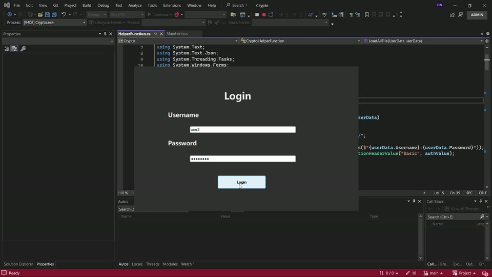
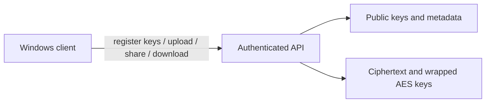

# Post-Quantum Secure File Sharing

[](https://learn.microsoft.com/dotnet/csharp/) [](https://dotnet.microsoft.com/) [](https://csrc.nist.gov/projects/post-quantum-cryptography)

An academic prototype for authenticated file sharing. Files are encrypted with AES-256-GCM, recipient keys are protected with ML-KEM-1024, and key enrollment is signed with ML-DSA-44.

> [!WARNING]
> Historical demo endpoints (`fastapi.crypto-lab.cloud` and `minio-ui.crypto-lab.cloud`) and demo accounts (`admin`, `user1`-`user3`) were revoked after the course demonstration. No passwords, private keys, or active credentials are included in this repository.

## Demo

[](docs/crypto-project-demo.mp4)

**[Open the full demo video](docs/crypto-project-demo.mp4)** - 1280x720, 7:14. The recording shows login, key registration, encrypted upload, file sharing, access-controlled listing, and download.

## What it demonstrates

- C# WinForms client for login, key registration, upload, sharing, refresh, and download.
- AES-256-GCM for file confidentiality and integrity.
- ML-KEM-1024 for wrapping a fresh file-encryption key for each recipient.
- ML-DSA-44 for signed public-key enrollment and protection against key replacement.
- Server-side access control lists (ACLs) for owner and recipient authorization.

## Protocol at a glance



1. The client registers ML-KEM and ML-DSA public keys with a signed enrollment request.
2. A fresh AES-256 key encrypts each file locally with AES-GCM.
3. Sharing wraps that AES key for the recipient's ML-KEM public key and records the recipient in the ACL.
4. The server checks the ACL before returning ciphertext; the recipient decapsulates and decrypts locally.

## Run locally

- Windows, Visual Studio, and the **.NET Framework 4.7.2 Developer Pack**
- Python 3 with `alkindi`, `pycryptodome`, and `requests`

```powershell
pip install alkindi pycryptodome requests
```

Open `Crypto.sln` in Visual Studio and run the WinForms client. The backend and Python helper scripts used in the original demonstration are not included in this repository.

## Documentation

- [Public-safe project report](docs/crypto-project-report.md)

## Scope

This is an educational prototype, not production-ready cryptographic software. It has not received an independent security review. Do not reuse credentials, private keys, or deployment endpoints from older local copies of the course project.
