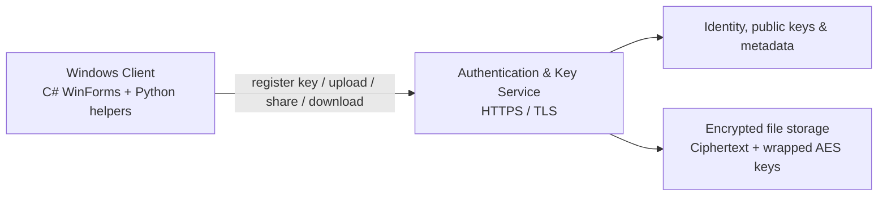

# Post-Quantum Secure File Sharing

[](https://learn.microsoft.com/dotnet/csharp/)
[](https://dotnet.microsoft.com/)
[](https://www.python.org/)
[](https://csrc.nist.gov/projects/post-quantum-cryptography)

An academic prototype for authenticated internal file sharing. The workflow encrypts file content with AES-GCM, protects each recipient's file key with ML-KEM-1024, and verifies key enrollment with ML-DSA-44.

> **Project context:** UIT Cryptography course project. This repository contains the Windows client; the backend/deployment used in the original demonstration is not included here.

## Highlights

- C# WinForms client for login, key registration, file upload, refresh, download, and sharing workflows.
- AES-256-GCM encrypts file content locally, keeping ciphertext and authenticated metadata together.
- ML-KEM-1024 encapsulates a per-recipient AES key so a shared file can be decrypted only by an authorized recipient.
- ML-DSA-44 (Dilithium) signs public-key enrollment before the server accepts it.
- Server-side access control lists (ACLs) determine who can retrieve a file and its wrapped key.

## System design



## Cryptographic flow

1. **Enroll:** the client generates ML-KEM and ML-DSA key pairs, then signs the public-key registration.
2. **Encrypt and upload:** the client generates a fresh AES-256 key and encrypts the file with AES-GCM.
3. **Share:** the client encapsulates that AES key with each recipient's ML-KEM public key; the service records the wrapped key in the file ACL.
4. **Download:** after an ACL check, the recipient decapsulates the AES key and verifies/decrypts the file locally.

## Run locally

### Prerequisites

- Windows with Visual Studio and the **.NET Framework 4.7.2 Developer Pack**
- Python 3
- A compatible backend configured for a local test environment

Install the Python packages used by the helper scripts:

```powershell
pip install alkindi pycryptodome requests
```

Open `Crypto.sln` in Visual Studio, restore the solution dependencies, configure a test backend, and run the WinForms project. Do not reuse credentials, URLs, or private-key material from an earlier demo environment.

## Security scope

This is an educational prototype, not production-ready cryptographic software. A production deployment would require an independent security review, managed key storage, secret rotation, hardened server-side authorization, and a maintained dependency/update process.

## Repository hygiene

Build output, local Python environments, and secret material are excluded by [`.gitignore`](.gitignore). Existing tracked artifacts need a separate, deliberate cleanup before they are removed from version control.
